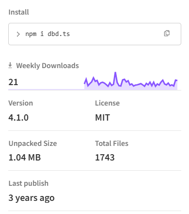

# dbd.ts
This repo holds the "reverse engineered" version of dbd.ts built from the compiled source.
> Original project is under the MIT license.


> [!IMPORTANT]  
> Project is not fully finished and I guess it wont be. It is based on the last 3.x.x build but takes some elements from 4.x.x

<br/>
    <p>
    <a href="https://discord.gg/HMUfMXDQsV"></a>
  </p>

# dbd.ts
[](https://discord.gg/HMUfMXDQsV)
[](https://www.npmjs.com/package/dbd.ts)
[](https://www.npmjs.com/package/dbd.ts)

  <br />
    <p>
    <a href="https://discord.gg/HMUfMXDQsV"></a>
  </p>

## About

dbd.ts is a powerful TypeScript Package allowing you to create Discord Bots simplified and quick.

- Interaction Commands Support
- Custom Functions / Plugins Support
- Fast and non-cache heavy
- 300+ functions built-in

## dbd.ts vs aoi.js

aoi.js allows users to create their Discord Bots with "ease" but the main issue it's not as friendly for Developers wanting to create their own functions or customization.

- aoi.js doesn't allow for users to create their own Functions / using Plugin.
- It built on JS which can lead to several issues long term of stability and performance.
- aoi.js is heavy on cache consumption / resources unlike dbd.ts it's not the case.


## Installation

**Node.JS 16.6.0 or newer is required.**

```sh-session
npm install dbd.ts
```

### Setup
```js
const dbd = require("dbd.ts")

const bot = new dbd.Bot({
    intents: ["GUILDS", "GUILD_MESSAGES"], //Discord Intents
    prefix: "PREFIX" //Discord Client Prefix
})

bot.addEvent([
    "onMessage"
])

bot.commands.add({
    type: "basicCommand",
    name: "ping",
    code: "Pong! $pingms"
})

bot.login("Discord Bot Token")
```

### Sideload Plugins
With this basic example of how to use plugins and sideload your own or other functions, it's simple.
```js
/**
 * This below will only work if you are using a proper IDE, so intellisense does it's job.
 * @type {import("dbd.ts").FunctionData}
 */ 
const func = {
    // This would be the name for the plugin or function.
    name: "$systemChannelID",
    
    // You cannot skip this on typescript, but in javascript.
    description: "return system channel id of the guild.",

    // This function is called every time this function is used.
    execute: (d, fn) => {
        // Watch out! data.message will not always be a Message object, so is recommend to use instanceof to check what it actually is before ever returning anything.
        return fn.resolve(
            d.data.message.guild?.systemChannelID
        )
    }
}

// Export function.
module.exports = func
//This isn't a exact function hence "plugins"
// Belong line would work too
// module.exports.default = func
```

## Links
- [Documentation](https://dbd-ts.gitbook.io)
- [Discord Server](https://discord.gg/HMUfMXDQsV)
